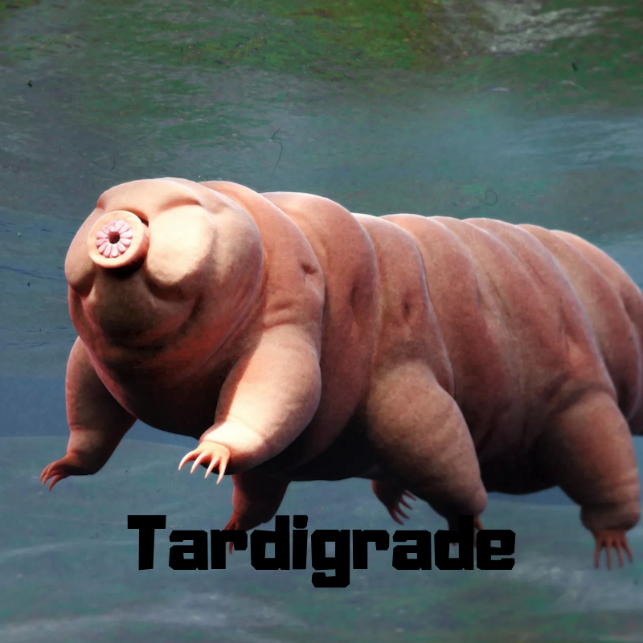

<!-- Slide gallery -->

  

    

      

        
        

          

            <a href="tardigrade.html" role="button" class="btn btn-success">Details</a>
          

        

      

    

    

      

        
        

          

            <a href="lizzard.html" role="button" class="btn btn-success">Details</a>
          

        

      

    

<!-- End Thumbnails -->

